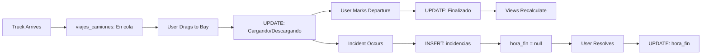

Dashboard Backus uses Supabase (PostgreSQL) for data storage and real-time updates. The application reads from views and tables, and writes to tables directly.

## Database Architecture

The application follows a single source of truth pattern implemented in `src/services/supabaseService.ts`:

- **SELECT**: Reads from views and tables
- **INSERT**: Creates incident records in `incidencias`
- **UPDATE**: Updates trip status in `viajes_camiones`
- **Realtime**: Subscribes to `postgres_changes` for live UI updates

## Core Tables

### usuarios

Stores user accounts with role-based access control.

```sql
CREATE TABLE public.usuarios (
  id         SERIAL PRIMARY KEY,
  email      TEXT NOT NULL UNIQUE,
  pin        TEXT NOT NULL,        -- stored as md5(password)
  rol        TEXT NOT NULL CHECK (rol IN ('admin', 'cliente')),
  nombre     TEXT,
  activo     BOOLEAN DEFAULT TRUE,
  created_at TIMESTAMPTZ DEFAULT NOW()
);
```

**Key Features:**
- Passwords are stored as MD5 hashes (matching PostgreSQL `md5()` function)
- Row Level Security enabled (see `supabase_usuarios.sql:23`)
- Two roles: `admin` (can modify semaphore times) and `cliente` (read-only times)

**Default Users:**
```sql
INSERT INTO usuarios (email, pin, rol, nombre) VALUES
  ('admin@backus.com',   md5('admin123'),   'admin',   'Administrador Backus'),
  ('cliente@backus.com', md5('cliente123'), 'cliente', 'Cliente Backus');
```

### viajes_camiones

Tracks truck trips from arrival to departure.

**Key Columns:**
- `id` (SERIAL PRIMARY KEY) - Internal database ID
- `id_viaje` (TEXT UNIQUE) - Business trip identifier (e.g., "VJ-2024-001")
- `tracto` - License plate
- `frotcom` - Fleet management ID (optional)
- `propietario` - Owner company
- `fecha` - Date of arrival
- `hora_llegada` (TIME) - Arrival time
- `hora_salida` (TIME) - Departure time (null while in yard)
- `tipo_unidad` - Truck type: "parihuelero", "jumbo", "bi-tren", "tolva", or "otros"
- `operacion` - "Carga" or "Descarga"
- `tipo_carga` / `tipo_descarga` - Product type being loaded/unloaded
- `bahia_actual` - Currently assigned bay (e.g., "b1", "b2")
- `estado` - Trip status: "En cola", "Cargando", "Descargando", "Finalizado"
- `conteo_incidencias` - Number of registered incidents (max 3)

**State Flow:**
```
En cola → Cargando/Descargando → Finalizado
```

See `src/services/supabaseService.ts:73-120` for the data mapping logic.

### incidencias

Records incidents that pause truck processing time.

**Schema:**
- `id_incidencia` (SERIAL PRIMARY KEY)
- `id_camion` (INTEGER) - Foreign key to `viajes_camiones.id`
- `hora_inicio` (TIME) - Incident start time
- `hora_fin` (TIME) - Incident end time (null if still open)
- `duracion_calculada` (INTERVAL) - Auto-calculated duration by PostgreSQL

**Business Rules:**
- Maximum 3 incidents per truck
- 4th incident triggers critical alert to developers
- Open incidents have `hora_fin IS NULL`
- Incident time is excluded from net yard time calculations

See `src/services/supabaseService.ts:251-285` for incident management.

### configuracion_roles

Stores semaphore time thresholds per role.

**Purpose:**
- Admin users can modify yellow/red time thresholds
- Client users view thresholds in read-only mode

**Default Thresholds:**
- Green: ≤ 60 minutes
- Yellow: 61-120 minutes  
- Red: ≥ 121 minutes

## Database Views

Views provide aggregated, read-only data for dashboard panels.

### vista_unidad_prioridad

Returns the truck with the highest priority (longest wait time).

**Columns:**
- `tracto` - License plate
- `hora_llegada` - Arrival time
- `bahia_actual` - Current bay assignment (or null if in queue)
- `tiempo_transcurrido` - Time elapsed since arrival (PostgreSQL interval)

**Query Logic:**
- Filters: `estado ≠ 'Finalizado'`
- Orders by: `hora_llegada ASC`
- Limit: 1

Referenced in `src/services/supabaseService.ts:127-136`.

### vista_dashboard_turnos

Counts finalized trucks by shift and date.

**Columns:**
- `fecha` - Date (YYYY-MM-DD)
- `turno_1` - Count for shift 1 (07:00-15:00)
- `turno_2` - Count for shift 2 (15:01-23:00)
- `turno_3` - Count for shift 3 (23:01-06:59)

**Frontend Usage:**
Filters for today's date and displays the current shift's count.

Referenced in `src/services/supabaseService.ts:144-154`.

### vista_promedio_patio_neto

Calculates average net yard time (excluding incident durations).

**Columns:**
- `promedio_neto_patio` - Average net time as PostgreSQL interval ("HH:MM:SS")

**Calculation:**
```sql
AVG(hora_salida - hora_llegada - SUM(incident_durations))
```

**Frontend Parsing:**
The `intervalAMinutos()` helper (see `src/services/supabaseService.ts:182-211`) converts PostgreSQL intervals to minutes, handling:
- Standard format: "HH:MM:SS"
- Milliseconds: "HH:MM:SS.mmm"
- Negative values: "-HH:MM:SS" (for overnight shifts)
- Multi-day: "1 day 02:30:00"
- Timezone offsets: "HH:MM:SS+00"

Referenced in `src/services/supabaseService.ts:162-170`.

## Row Level Security

The `usuarios` table has RLS enabled with a policy that allows anonymous reads of active users:

```sql
CREATE POLICY "anon puede leer usuarios activos"
  ON public.usuarios FOR SELECT
  USING (activo = TRUE);
```

This allows the login flow to query users without authentication, while respecting the `activo` flag.

## Installation Script

Run the SQL setup script in your Supabase SQL Editor:

```bash
# Located at: supabase_usuarios.sql
```

<Steps>
  <Step title="Open Supabase Dashboard">
    Navigate to your project at [app.supabase.com](https://app.supabase.com)
  </Step>
  
  <Step title="Go to SQL Editor">
    Click **SQL Editor** in the left sidebar
  </Step>
  
  <Step title="Paste Setup Script">
    Copy the contents of `supabase_usuarios.sql` and paste into the editor
  </Step>
  
  <Step title="Execute">
    Click **Run** to create tables, views, and seed data
  </Step>
</Steps>

<Warning>
  The setup script includes `TRUNCATE public.usuarios` which will delete existing user data. Remove this line if you have existing users to preserve.
</Warning>

## Data Flow



## Realtime Subscriptions

The application subscribes to table changes for live updates:

```typescript
supabase
  .channel('viajes_changes')
  .on('postgres_changes', 
    { event: '*', schema: 'public', table: 'viajes_camiones' },
    (payload) => { /* refresh UI */ }
  )
  .subscribe();
```

This enables multiple users to see updates in real-time without manual refresh.

## Next Steps

<CardGroup cols={2}>
  <Card title="Environment Variables" icon="gear" href="/configuration/environment">
    Configure Supabase connection strings
  </Card>
  <Card title="Webhooks" icon="webhook" href="/configuration/webhooks">
    Set up n8n webhook automation
  </Card>
</CardGroup>