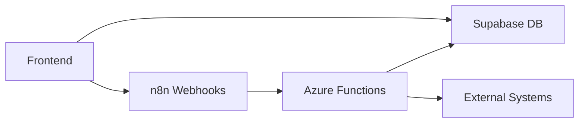

Dashboard Backus uses n8n workflow automation to handle backend processing through webhooks. The n8n instance is hosted on Microsoft Azure and receives events from the frontend via asynchronous HTTP requests.

## Architecture Overview

The webhook layer serves as a bridge between the Supabase database and external automation:



**Key Characteristics:**
- Webhooks are called asynchronously (fire-and-forget)
- Frontend does not wait for webhook responses
- Database writes happen directly via Supabase client
- n8n workflows can trigger additional processing or notifications

## Webhook Endpoints

The system defines three webhook endpoints mentioned in the README.

### 1. /actualizar-bahia

Triggered when a truck is dragged to a new bay position.

**Event:** `onDrop` in the drag-and-drop handler

**Timing:** After `actualizarBahiaDirecto()` succeeds (see `src/Componentes/SimuladorMapa.tsx:42`)

**Payload:**
```json
{
  "id_viaje": "VJ-2024-001",
  "bahia_anterior": "b1",
  "bahia_nueva": "b3",
  "estado": "Descargando",
  "timestamp": "2024-03-11T14:30:00Z"
}
```

**Use Cases:**
- Log bay transitions for analytics
- Notify warehouse staff of new arrivals
- Trigger automated bay assignment optimization
- Update external WMS (Warehouse Management System)

**Frontend Implementation:**
```typescript
const ok = await actualizarBahiaDirecto(id_viaje, nueva_bahia, 'Descargando');
if (!ok) console.error('[supabase] actualizarBahiaDirecto falló');
// Webhook call would happen here (not shown in current code)
```

### 2. /registrar-incidencia

Triggered when an incident is opened or closed.

**Events:**
- Incident start: After `abrirIncidencia()` succeeds
- Incident end: After `cerrarIncidencia()` succeeds

**Timing:** Called from incident modal (see `src/Componentes/ModalIncidencia.tsx:195`)

**Payload (Start):**
```json
{
  "id_incidencia": 42,
  "id_camion": 123,
  "id_viaje": "VJ-2024-001",
  "hora_inicio": "14:30:00",
  "evento": "inicio",
  "conteo_incidencias": 1
}
```

**Payload (End):**
```json
{
  "id_incidencia": 42,
  "id_camion": 123,
  "id_viaje": "VJ-2024-001",
  "hora_inicio": "14:30:00",
  "hora_fin": "15:45:00",
  "duracion": "01:15:00",
  "evento": "fin",
  "conteo_incidencias": 1
}
```

**Critical Alert:**
If a truck reaches 4 incidents, the webhook payload includes:
```json
{
  "alerta_critica": true,
  "mensaje": "Unidad ha alcanzado el límite de 3 incidencias",
  "requiere_escalamiento": true
}
```

This triggers an alert to developers (mentioned in README).

**Use Cases:**
- Real-time incident tracking dashboard
- Escalation to supervisors for repeated incidents
- Root cause analysis data collection
- Performance reports excluding incident time

**Business Rules:**
- Maximum 3 incidents per truck
- 4th incident prevents further registration
- Open incidents have `hora_fin = null`
- Incident durations are excluded from net yard time calculations

See `src/services/supabaseService.ts:251-285` for incident management logic.

### 3. /marcar-salida

Triggered when a truck departs the facility.

**Event:** User clicks "Marcar Salida" button

**Timing:** After `marcarSalidaDirecto()` succeeds (see `src/Componentes/SimuladorMapa.tsx:47-48`)

**Payload:**
```json
{
  "id_viaje": "VJ-2024-001",
  "tracto": "ABC-123",
  "hora_llegada": "08:00:00",
  "hora_salida": "16:30:00",
  "tiempo_total": "08:30:00",
  "bahia_final": "b3",
  "estado": "Finalizado",
  "incidencias": 1
}
```

**Use Cases:**
- Update external logistics system
- Generate departure confirmation
- Trigger gate access control
- Calculate final KPIs (time in yard, incidents, etc.)
- Archive completed trip records

**Database Update:**
```typescript
const ok = await marcarSalidaDirecto(id_viaje);
if (!ok) notify('Error al registrar salida', 'error');
```

See `src/services/supabaseService.ts:340-353` for implementation.

## n8n Workflow Setup

<Steps>
  <Step title="Create n8n Workflow">
    In your n8n instance (Azure-hosted), create a new workflow for each webhook endpoint
  </Step>
  
  <Step title="Add Webhook Trigger Node">
    Use the **Webhook** trigger node with these settings:
    - **HTTP Method**: POST
    - **Path**: `/actualizar-bahia`, `/registrar-incidencia`, or `/marcar-salida`
    - **Response Mode**: "Immediately"
    - **Response Code**: 200
  </Step>
  
  <Step title="Parse JSON Payload">
    Add a **Set** node to extract fields from `$json.body`
  </Step>
  
  <Step title="Add Business Logic">
    Connect nodes for your automation:
    - Send notifications (Email, Slack, SMS)
    - Update external systems (ERP, WMS)
    - Trigger analytics pipelines
    - Store audit logs
  </Step>
  
  <Step title="Copy Webhook URL">
    n8n provides a URL like:
    ```
    https://<your-n8n>.azurewebsites.net/webhook/actualizar-bahia
    ```
  </Step>
  
  <Step title="Configure Frontend">
    Add the webhook URLs to your environment variables or service configuration
  </Step>
</Steps>

## Frontend Integration

To call webhooks from the frontend, add a webhook service:

```typescript
// src/services/webhookService.ts

const WEBHOOK_BASE = import.meta.env.VITE_N8N_WEBHOOK_URL;

export async function notificarActualizacionBahia(
  id_viaje: string,
  bahia_anterior: string | undefined,
  bahia_nueva: string,
  estado: string
) {
  if (!WEBHOOK_BASE) return; // Webhooks disabled
  
  try {
    await fetch(`${WEBHOOK_BASE}/actualizar-bahia`, {
      method: 'POST',
      headers: { 'Content-Type': 'application/json' },
      body: JSON.stringify({
        id_viaje,
        bahia_anterior,
        bahia_nueva,
        estado,
        timestamp: new Date().toISOString(),
      }),
    });
  } catch (err) {
    console.warn('[webhook] actualizar-bahia failed:', err);
    // Don't throw - webhooks are non-critical
  }
}

export async function notificarIncidencia(
  evento: 'inicio' | 'fin',
  id_incidencia: number,
  id_camion: number,
  id_viaje: string,
  hora_inicio: string,
  hora_fin?: string
) {
  if (!WEBHOOK_BASE) return;
  
  const payload: any = {
    evento,
    id_incidencia,
    id_camion,
    id_viaje,
    hora_inicio,
    timestamp: new Date().toISOString(),
  };
  
  if (evento === 'fin' && hora_fin) {
    payload.hora_fin = hora_fin;
    // Calculate duration
    const [h1, m1, s1] = hora_inicio.split(':').map(Number);
    const [h2, m2, s2] = hora_fin.split(':').map(Number);
    const duracionMin = (h2*60 + m2 + s2/60) - (h1*60 + m1 + s1/60);
    const h = Math.floor(duracionMin / 60);
    const m = Math.floor(duracionMin % 60);
    payload.duracion = `${h.toString().padStart(2,'0')}:${m.toString().padStart(2,'0')}:00`;
  }
  
  try {
    await fetch(`${WEBHOOK_BASE}/registrar-incidencia`, {
      method: 'POST',
      headers: { 'Content-Type': 'application/json' },
      body: JSON.stringify(payload),
    });
  } catch (err) {
    console.warn('[webhook] registrar-incidencia failed:', err);
  }
}

export async function notificarSalida(
  id_viaje: string,
  tracto: string,
  hora_llegada: string,
  hora_salida: string,
  bahia_final: string,
  incidencias: number
) {
  if (!WEBHOOK_BASE) return;
  
  try {
    await fetch(`${WEBHOOK_BASE}/marcar-salida`, {
      method: 'POST',
      headers: { 'Content-Type': 'application/json' },
      body: JSON.stringify({
        id_viaje,
        tracto,
        hora_llegada,
        hora_salida,
        bahia_final,
        estado: 'Finalizado',
        incidencias,
        timestamp: new Date().toISOString(),
      }),
    });
  } catch (err) {
    console.warn('[webhook] marcar-salida failed:', err);
  }
}
```

## Environment Variables

Add to `.env`:

```bash
# n8n Webhook Base URL (Azure-hosted)
VITE_N8N_WEBHOOK_URL=https://<your-n8n>.azurewebsites.net/webhook
```

If this variable is not set, webhooks are silently disabled (graceful degradation).

## Error Handling

**Philosophy:** Webhooks are non-critical. Database operations must succeed even if webhooks fail.

**Implementation:**
```typescript
try {
  await fetch(webhookUrl, {...});
} catch (err) {
  console.warn('[webhook] failed:', err);
  // Don't throw - continue normal operation
}
```

**Monitoring:**
- Check n8n execution logs for failed workflows
- Set up alerts for repeated webhook failures
- Monitor Azure Function App metrics

## Security Considerations

<Warning>
  Webhook URLs are publicly accessible. Implement security measures:
</Warning>

1. **API Key Authentication**
   ```typescript
   headers: {
     'Content-Type': 'application/json',
     'X-API-Key': import.meta.env.VITE_WEBHOOK_API_KEY,
   }
   ```

2. **IP Whitelisting**
   Configure Azure to only accept requests from your Vercel deployment IPs

3. **Request Signing**
   Use HMAC signatures to verify webhook authenticity:
   ```typescript
   const signature = crypto
     .createHmac('sha256', SECRET)
     .update(JSON.stringify(payload))
     .digest('hex');
   headers['X-Signature'] = signature;
   ```

4. **Rate Limiting**
   Implement rate limiting in n8n or Azure to prevent abuse

## Testing Webhooks

Use curl to test webhook endpoints:

```bash
# Test actualizar-bahia
curl -X POST https://your-n8n.azurewebsites.net/webhook/actualizar-bahia \
  -H "Content-Type: application/json" \
  -d '{
    "id_viaje": "TEST-001",
    "bahia_anterior": "b1",
    "bahia_nueva": "b3",
    "estado": "Descargando",
    "timestamp": "2024-03-11T14:30:00Z"
  }'

# Test registrar-incidencia
curl -X POST https://your-n8n.azurewebsites.net/webhook/registrar-incidencia \
  -H "Content-Type: application/json" \
  -d '{
    "evento": "inicio",
    "id_incidencia": 42,
    "id_camion": 123,
    "id_viaje": "TEST-001",
    "hora_inicio": "14:30:00"
  }'

# Test marcar-salida
curl -X POST https://your-n8n.azurewebsites.net/webhook/marcar-salida \
  -H "Content-Type: application/json" \
  -d '{
    "id_viaje": "TEST-001",
    "tracto": "ABC-123",
    "hora_llegada": "08:00:00",
    "hora_salida": "16:30:00",
    "bahia_final": "b3",
    "estado": "Finalizado",
    "incidencias": 1
  }'
```

Check n8n execution history to verify the workflows triggered successfully.

## Common n8n Workflow Patterns

### Send Slack Notification on Incident

```
Webhook Trigger → IF (evento = "inicio") → Slack Node
```

**Slack Message:**
```
🚨 Incidencia iniciada
Unidad: {{ $json.id_viaje }}
Hora: {{ $json.hora_inicio }}
Conteo: {{ $json.conteo_incidencias }}/3
```

### Update External WMS on Bay Change

```
Webhook Trigger → HTTP Request (External API) → Error Handler
```

### Log All Events to BigQuery

```
Webhook Trigger → Transform Data → Google BigQuery Insert
```

## Next Steps

<CardGroup cols={2}>
  <Card title="Database Schema" icon="database" href="/configuration/database">
    Understand the tables webhooks interact with
  </Card>
  <Card title="Bay Configuration" icon="map" href="/configuration/bay-configuration">
    See bay IDs referenced in webhook payloads
  </Card>
</CardGroup>