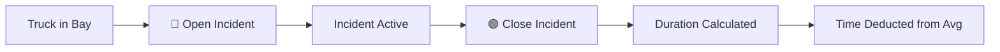

## Overview

Incidents in Dashboard Backus represent operational delays that occur while a truck is in a bay. The system tracks incident duration and automatically deducts it from average yard time calculations, ensuring accurate performance metrics.

<Info>
  Incidents are tracked per truck with a maximum limit of **3 incidents** per truck. This limit enforces operational quality standards.
</Info>

## What Qualifies as an Incident?

Common incident types include:

- **Equipment failure**: Forklift breakdown, loading system malfunction
- **Documentation delays**: Missing paperwork, signature approval wait times
- **Quality issues**: Product inspection holds, contamination checks
- **Safety incidents**: Emergency stops, evacuation protocols
- **Coordination delays**: Waiting for specific personnel, cross-dock dependencies
- **Infrastructure problems**: Bay door issues, lighting failures, spills

<Warning>
  Normal processing time is **not** an incident. Only register incidents for unexpected delays outside standard operational flow.
</Warning>

## Incident Workflow

Incidents follow a two-step lifecycle:



### Opening an Incident

<Steps>
  <Step title="Identify Delay Event">
    Recognize that an unexpected delay has occurred or is about to occur for a truck currently in a bay.
  </Step>
  
  <Step title="Click '⚠️ Incid.' Button">
    Located at the bottom left of the occupied bay card, next to the "✅ Salida" button.
    
    <Note>
      Incident management is only available to **Admin** users.
    </Note>
  </Step>
  
  <Step title="Review Incident Modal">
    The Incident Management modal displays:
    
    - **Truck information**: Plate, bay, product, operation, shift
    - **Incident counter**: Visual slots showing 1/3, 2/3, or 3/3 incidents
    - **Active incident indicator**: 🔴 pulsing dot if an incident is currently open
    - **Average incident duration**: Mean time of all closed incidents for this truck
    
    <Check>
      If no incidents are registered yet, counter shows three empty slots: [1] [2] [3]
    </Check>
  </Step>
  
  <Step title="Click '🔴 Abrir incidencia'">
    This button is:
    - **Enabled** when:
      - No incident is currently open (`hora_fin IS NOT NULL` for all incidents)
      - Incident count < 3
    - **Disabled** when:
      - An incident is already open (must close before opening new one)
      - Incident limit reached (3/3)
    
    <Warning>
      You cannot open multiple incidents simultaneously for the same truck. Close the active incident before opening a new one.
    </Warning>
  </Step>
  
  <Step title="Database Insert">
    The system performs an INSERT to the `incidencias` table:
    
    ```sql
    INSERT INTO incidencias (id_camion, hora_inicio, hora_fin)
    VALUES (42, '14:32:15', NULL);
    ```
    
    Fields:
    - `id_incidencia`: Auto-generated primary key
    - `id_camion`: Foreign key to `viajes_camiones.id` (integer)
    - `hora_inicio`: Current time as "HH:MM:SS" (TIME type)
    - `hora_fin`: NULL (will be set when incident is closed)
    - `duracion_calculada`: NULL initially, calculated by Postgres trigger on UPDATE
    
    <Check>
      Success toast: "⚠️ Incidencia 1/3 abierta — BFW-234"
    </Check>
  </Step>
  
  <Step title="Incident Active State">
    While open:
    - Bay displays 🔴 pulsing dot next to traffic light
    - Incident counter shows filled red slot with ● symbol
    - Modal displays: "Incidencia activa — sin hora de cierre"
    - Wait time timer continues running (traffic light still updates)
  </Step>
</Steps>

### Closing an Incident

<Steps>
  <Step title="Confirm Delay Resolved">
    Verify with yard staff that the incident cause has been resolved and normal operations have resumed.
  </Step>
  
  <Step title="Open Incident Modal">
    Click the "⚠️ Incid." button on the bay card (same as opening).
  </Step>
  
  <Step title="Click '🟢 Cerrar incidencia'">
    This button is:
    - **Enabled** when an incident is currently open
    - **Disabled** when no incident is open
    
    <Info>
      You can close an incident even if the truck has reached the 3-incident limit.
    </Info>
  </Step>
  
  <Step title="Database Update">
    The system performs an UPDATE to the `incidencias` table:
    
    ```sql
    UPDATE incidencias
    SET hora_fin = '14:47:30'
    WHERE id_camion = 42
      AND hora_fin IS NULL;
    ```
    
    **Postgres Trigger**: After the UPDATE, a database trigger calculates `duracion_calculada`:
    
    ```sql
    duracion_calculada = hora_fin - hora_inicio
    -- Result: '00:15:15' (15 minutes, 15 seconds as INTERVAL type)
    ```
    
    <Check>
      Success toast: "✅ Incidencia cerrada — BFW-234"
    </Check>
  </Step>
  
  <Step title="Metrics Update">
    The closed incident:
    - Increments the truck's incident counter (1/3 → 2/3)
    - Replaces pulsing red ● with static yellow ✓ checkmark in modal
    - Removes 🔴 pulsing indicator from bay card
    - Adds incident duration to truck's total incident time for average deduction
  </Step>
</Steps>

## Incident Counter System

### Visual Representation

The incident modal displays three slots:

```
No incidents:
[1] [2] [3]  ← Empty gray slots

1 closed incident:
[✓] [2] [3]  ← Yellow checkmark, orange border

1 open incident:
[●] [2] [3]  ← Red dot (pulsing), red border

2 closed, 1 open:
[✓] [✓] [●]  ← Two yellow checks, one red pulsing dot

3 closed (limit reached):
[✓] [✓] [✓]  ← All slots filled, red border on counter box
```

### Incident Limit Enforcement

When a truck reaches **3 incidents**:

<Warning>
  **HARD LIMIT**: No additional incidents can be opened for this truck.
</Warning>

**System Behavior**:
1. "🔴 Abrir incidencia" button is permanently disabled
2. Red alert box appears in modal:
   ```
   🚨 Límite de incidencias alcanzado (3/3)
   Este camión ha alcanzado el máximo de incidencias permitidas.
   Comuníquese con los desarrolladores para continuar.
   ```
3. Attempting to open an incident shows error toast:
   ```
   🚨 Límite de 3 incidencias alcanzado. Contactar a los desarrolladores.
   ```
4. The truck can still be processed and exited normally
5. No further incident time will be deducted from this truck's yard time

<Info>
  The 3-incident limit is defined in `ModalIncidencia.tsx:21` as `MAX_INCIDENCIAS = 3`.
</Info>

### Why the Limit Exists

The incident limit serves multiple purposes:

- **Quality control**: Trucks with excessive incidents indicate systemic issues
- **Data integrity**: Prevents abuse or accidental over-registration
- **Escalation trigger**: Forces manual review by developers/management
- **Performance accuracy**: Excessive incidents could artificially inflate net time calculations

## Time Deduction Mechanics

### How Incident Time is Calculated

The system uses **net yard time** for performance metrics:

```typescript
Gross Yard Time = hora_salida - hora_llegada
Total Incident Time = SUM(duracion_calculada) for all closed incidents
Net Yard Time = Gross Yard Time - Total Incident Time
```

**Example**:
```
Truck arrival: 08:00:00
Truck exit:    09:30:00
Gross time:    90 minutes

Incident 1: 08:15:00 - 08:25:00 = 10 minutes
Incident 2: 09:00:00 - 09:12:00 = 12 minutes
Total incident time: 22 minutes

Net yard time: 90 - 22 = 68 minutes
```

### Average Yard Time Panel

The "Average Yard Time" panel (left side of map) displays:

```
⏱ Tiempo Promedio Patio
     45.3 min
promedio neto del día
✓ incidencias descontadas
```

This value is calculated by the `vista_promedio_patio_neto` Supabase view:

```sql
SELECT AVG(
  (hora_salida - hora_llegada) - COALESCE(SUM(duracion_calculada), '00:00:00')
) AS promedio_neto_patio
FROM viajes_camiones
LEFT JOIN incidencias ON viajes_camiones.id = incidencias.id_camion
WHERE estado = 'Finalizado'
  AND fecha = CURRENT_DATE
GROUP BY viajes_camiones.id;
```

<Check>
  The green checkmark "✓ incidencias descontadas" confirms that incident time has been automatically deducted.
</Check>

## Real-Time Incident Monitoring

### Bay Card Indicator

When an incident is active:

- **🔴 Pulsing dot** appears next to the traffic light in the bay header
- Animation: CSS `pulse` keyframe (1 second cycle)
- Tooltip: "Incidencia activa sin cerrar"
- Updates via polling every **8 seconds** (`fetchIncidenciaAbierta()`)

<Note>
  The incident indicator is separate from the traffic light. A bay can show:
  - 🟢 Green traffic light (short wait) + 🔴 Red incident dot (active incident)
  - 🔴 Red traffic light (long wait) + no incident dot (no incidents)
</Note>

### Incident Modal Polling

While the incident modal is open, the system polls Supabase every **5 seconds** for:

1. **Incident count**: `contarIncidencias(id_camion)` - Total incidents (open + closed)
2. **Open incident status**: `fetchIncidenciaAbierta(id_camion)` - Boolean for active incident
3. **Average incident duration**: `fetchPromedioIncidencias(id_camion)` - Mean of closed incidents

<Info>
  Polling ensures the modal stays synchronized if another user opens/closes incidents for the same truck (multi-user scenario).
</Info>

## Common Incident Scenarios

### Scenario 1: Equipment Failure Mid-Operation

```
Time:     10:30 - Forklift breaks down while loading truck BFW-234
Action:   Operator opens incident immediately
Duration: 10:30 - 11:15 (45 minutes to repair/replace forklift)
Result:   Incident closed at 11:15, operations resume
Impact:   45 minutes deducted from truck's net yard time
```

### Scenario 2: Documentation Hold

```
Time:     14:00 - Missing signature for hazmat product on truck CTM-789
Action:   Operator opens incident
Duration: 14:00 - 14:20 (20 minutes to locate supervisor and sign)
Result:   Incident closed at 14:20, loading continues
Impact:   20 minutes deducted from truck's net yard time
```

### Scenario 3: Multiple Sequential Incidents

```
Truck:    BHQ-456 (Bi-tren)

Incident 1: 08:30 - 08:45 (15 min) - Bay door jam
Incident 2: 09:10 - 09:30 (20 min) - Product quality check hold
Incident 3: 10:00 - 10:10 (10 min) - System connectivity issue

Total incident time: 45 minutes
Limit reached: Cannot register more incidents for this truck
Action required: Escalate to management if further delays occur
```

## Best Practices

<AccordionGroup>
  <Accordion title="Open Incidents Immediately">
    - Register incidents as soon as the delay is identified
    - Don't wait until the delay is resolved to open the incident
    - Accurate start times ensure correct duration calculation
    
    <Tip>
      If you discover a delay occurred earlier, open and close the incident immediately with a note documenting the actual timeframe.
    </Tip>
  </Accordion>
  
  <Accordion title="Close Incidents Promptly">
    - Close incidents as soon as normal operations resume
    - Do not leave incidents open "just in case" further delays occur
    - If a new delay starts, open a new incident (up to the limit)
    
    <Warning>
      Leaving incidents open artificially inflates deduction time and distorts average yard time metrics.
    </Warning>
  </Accordion>
  
  <Accordion title="Monitor Incident Frequency">
    - Review incident counts across trucks to identify patterns
    - High incident rates (>20% of trucks) indicate systemic issues
    - Track which bays have frequent incidents (may need maintenance)
    - Use session reports to analyze incident duration trends
  </Accordion>
  
  <Accordion title="Document Incident Causes">
    - While the system doesn't store incident descriptions, maintain a separate log
    - Record incident type, cause, and resolution for post-shift review
    - Use this data to inform process improvements and preventive maintenance
  </Accordion>
  
  <Accordion title="Handle Limit-Reached Trucks">
    - Expedite processing for trucks at 3/3 incidents
    - Investigate root causes with operations team
    - Consider reassigning to a different bay if issues are bay-specific
    - Document for management review and follow-up
  </Accordion>
</AccordionGroup>

## Incident Data Structure

### Database Schema

**Table**: `incidencias`

| Column | Type | Description |
|--------|------|-------------|
| `id_incidencia` | SERIAL | Primary key, auto-increment |
| `id_camion` | INTEGER | Foreign key to `viajes_camiones.id` |
| `hora_inicio` | TIME | Start time (HH:MM:SS), set when opened |
| `hora_fin` | TIME | End time (HH:MM:SS), NULL when open |
| `duracion_calculada` | INTERVAL | Auto-calculated on close: `hora_fin - hora_inicio` |

### Example Records

```sql
id_incidencia | id_camion | hora_inicio | hora_fin  | duracion_calculada
--------------|-----------+-------------+-----------+-------------------
          101 |        42 | 08:15:00    | 08:25:00  | 00:10:00
          102 |        42 | 09:00:00    | 09:12:00  | 00:12:00
          103 |        43 | 10:30:00    | NULL      | NULL              ← Open incident
          104 |        44 | 14:00:00    | 14:45:30  | 00:45:30
```

## Troubleshooting

### Cannot Open Incident

**Symptom**: "🔴 Abrir incidencia" button is disabled

**Possible Causes**:
1. **Incident already open**: Close the current incident first
   - Check for 🔴 pulsing dot in bay card
   - Modal shows "Incidencia activa — sin hora de cierre"
   
2. **Incident limit reached**: Truck has 3/3 incidents
   - Modal shows red alert box
   - Contact developers/management for guidance

**Solution**: Verify incident status in modal, close open incident if applicable

### Incident Not Closing

**Symptom**: Clicking "🟢 Cerrar incidencia" shows loading but no success toast

**Possible Causes**:
- Network connection issue
- Database constraint violation
- No open incident exists (stale UI state)

**Solution**:
1. Check browser DevTools Network tab for failed request
2. Close and reopen the modal to refresh data
3. Verify in database that `hora_fin IS NULL` for an incident
4. Wait 5 seconds and retry

### Incident Duration Not Deducted

**Symptom**: Average Yard Time panel doesn't reflect incident deductions

**Possible Causes**:
- Incident not closed (still has `hora_fin = NULL`)
- Database trigger didn't calculate `duracion_calculada`
- Truck not yet finalized (only finalized trucks count in average)

**Solution**:
1. Verify incident is closed (no 🔴 pulsing dot)
2. Check database: `SELECT * FROM incidencias WHERE id_camion = 42;`
3. Confirm truck has `estado = 'Finalizado'`
4. Wait 15 seconds for panel polling to update

### Incident Counter Incorrect

**Symptom**: Modal shows 2/3 but only 1 incident is visible in database

**Possible Causes**:
- Stale data from polling delay
- Multiple tabs/users modifying same truck
- `conteo_incidencias` field in `viajes_camiones` out of sync

**Solution**:
1. Close and reopen modal to force refresh
2. Verify actual count: `SELECT COUNT(*) FROM incidencias WHERE id_camion = 42;`
3. If discrepancy persists, may need database trigger repair

## Next Steps

<CardGroup cols={2}>
  <Card title="Monitoring Operations" icon="chart-line" href="/guides/monitoring-operations">
    Learn how incident data affects real-time performance metrics
  </Card>
  
  <Card title="Generating Reports" icon="file-chart-column" href="/guides/reports">
    Access detailed incident analytics in session reports
  </Card>
</CardGroup>